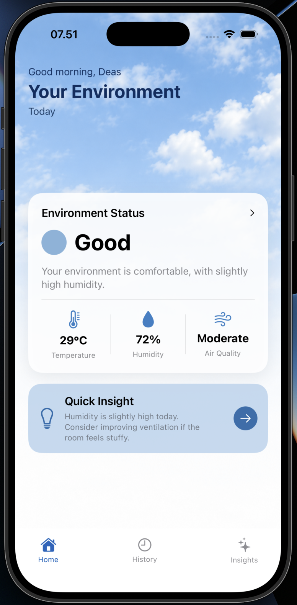
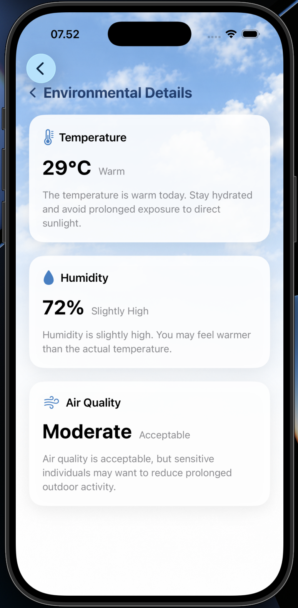
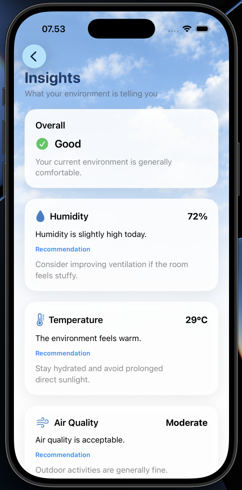
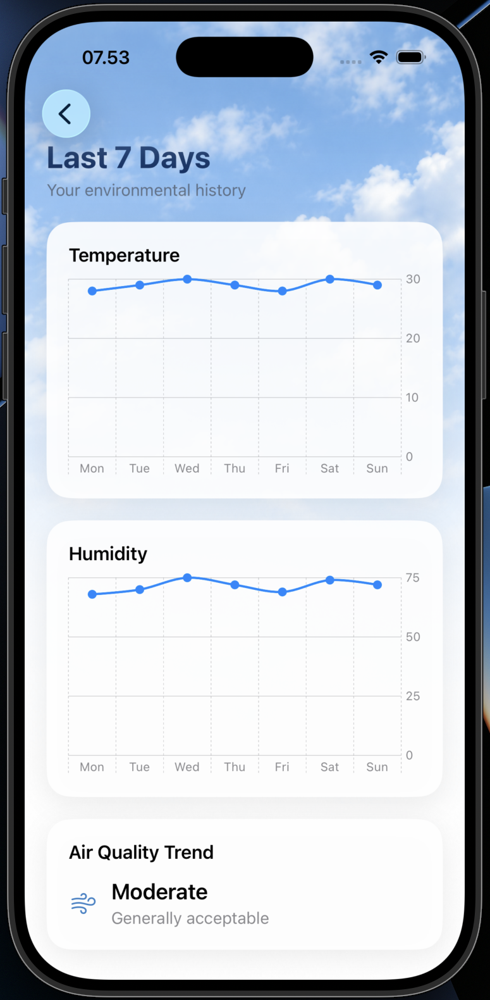

# AirAware

An iOS application that helps users understand their environmental conditions through temperature, humidity, and air quality data, presented through simple insights and actionable recommendations.

## Overview

AirAware is an iOS MVP created to explore how environmental sensor data can be transformed into a simple and user-friendly mobile experience.

Instead of presenting raw environmental measurements alone, AirAware focuses on helping users understand what the data means and what they can do about it.

The current MVP uses simulated environmental data to demonstrate the application's interface, interaction flow, and core concept.

## Features

- 🌡️ Temperature monitoring
- 💧 Humidity monitoring
- 🌬️ Air quality status
- 💡 Environmental insights and recommendations
- 📊 7-day environmental history
- 📱 Multi-screen iOS interface
- 🧭 Simple navigation between Home, Details, Insights, and History

## Screenshots

## Screenshots

### Home


### Environmental Details


### Insights


### History


## Design

The user interface was designed and prototyped in Figma, focusing on a clean and intuitive experience for understanding environmental conditions.

**Figma Design:** [View AirAware on Figma](https://www.figma.com/design/K29OkBJe7MjQMvKb6XrMX0/AirAware?node-id=0-1&t=ZKZEKPyrdoRuh9R1-1)

## Tech Stack

- Swift
- SwiftUI
- Swift Charts
- Xcode
- Figma

## How It Works

AirAware currently uses simulated environmental data to demonstrate the application's core experience.

The application presents three main environmental measurements:

1. Temperature
2. Humidity
3. Air Quality

These values are then interpreted into simple environmental statuses and recommendations to make the information easier to understand.

## Project Development

AirAware was developed as an MVP exploration of iOS development using SwiftUI.

The development process included:

- Designing the initial interface in Figma
- Exploring SwiftUI components and navigation
- Building the application's main screens
- Implementing environmental data presentation
- Adding interactive navigation
- Creating environmental history charts using Swift Charts
- Testing the application using the iPhone Simulator

## Future Development

Future versions of AirAware could connect the application to real environmental sensor data.

A possible development direction is:

```text
Environmental Sensors
        ↓
ESP32 / IoT Device
        ↓
Cloud / API
        ↓
AirAware iOS App
